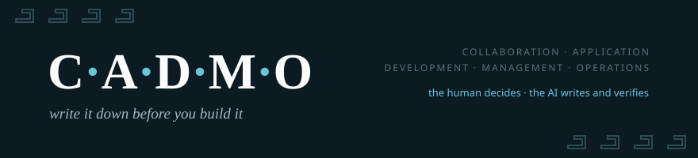

<p align="center"></p>

<p align="center">
  <a href="https://www.npmjs.com/package/create-cadmo"></a>
  <a href="LICENSE"></a>
  <a href="LICENSE"></a>
  <a href="CONTRIBUTING.md"></a>
</p>

# Cadmo

**A right-sized method for building software with AI as your pair — the human specifies and decides; the AI writes and verifies.**

```bash
npm create cadmo
```
*One command drops the method into your project: `AGENTS.md` (the map your AI reads first) + the value-gate, spec and plan templates. Nothing is ever overwritten.*

AI made writing code fast and cheap. The risk moved from *"it takes too long"* to *"it builds the wrong thing, with confidence."* Cadmo is built for the game that actually matters now: not writing faster — **specifying, verifying and documenting at the speed AI writes.**

> In Greek myth, **Cadmus** brought the alphabet — the written word — to Greece. *Cadmo* is his name in Portuguese — the method was born in Brazil. Its first principle is the same: **write it down before you build it.** The spec before the code, the decision with its reasoning, the documentation as a living artifact your client validates — and the system obeys.

<sub>The name is also an acronym of the five pillars: **C**ollaboration · **A**pplication · **D**evelopment · **M**anagement · **O**perations.</sub>

---

## Who it's for

Solo consultants and small teams shipping production software for real clients — operations too lean for enterprise process, too accountable for no process. If you build with AI and someone else depends on what you ship, Cadmo is sized for you.

## Why

Building with AI fails in a specific way: black-box systems only their author can explain, governance no client can audit, knowledge that lives in one person's head and walks out the door. Cadmo answers by **inverting where the care is spent**: rigor *before* the code (specify the rules, get them validated) and *after* it (tests derived from the specs, a definition of done, verification in staging) — so the middle, the execution, can be fast without being reckless.

It is **not** bureaucracy (right-sizing is the meta-principle — trivial work stays trivial), **not** blind trust in AI (human gates and a verification harness exist precisely because an unverified agent hallucinates completion), and **not** an off-the-shelf process — it's a pragmatic hybrid of the traditions that actually work, sized for a lean operation that still answers to clients who demand governance.

## The five pillars

| Pillar | Question it answers | In one line |
|---|---|---|
| 🗂️ **Management** | Is it worth building? Did it deliver the value? | Every relevant demand passes a value gate before a spec; after delivery, the benefit is checked. |
| 🛠️ **Development** | Are we building it right? | Rules are written *before* the code; tests derived from them run on every change; nothing ships without human approval. |
| ⚙️ **Operations** | Is it live and reliable? | Continuous monitoring, every data load logged, every incident yielding a prevention that makes the system *more diagnosable*. |
| 🤝 **Collaboration** | How does a second developer join without losing the gates? | The method travels in the repo; each dev runs their own AI; the maintainer is the only merge/production gate. |
| 🧭 **Application** | How do we instantiate all of this for a new client/project? | A right-sized checklist — the assembly line that turns the generic method into a running instance. |

The three cores (Management, Development, Operations) cover the full lifecycle: **decide → build → maintain** (and the loop feeds back). Collaboration scales the pair into a team; Application is how the whole thing gets installed somewhere new.

## What's distinctive

- **AI as an engineering pair, not an assistant** — the human specifies and decides; the AI writes and verifies. The bottleneck moved from *writing* to *verifying*, and the method is built around winning that.
- **Documentation that cannot silently lie** — a spec declares which files implement it (`watches:`), and [a 100-line CI check](docs/spec-drift.md) fails any change that touches those files without updating the spec. Client-validated docs with signature + exact version, kept true by a mechanism, not by discipline.
- **The method travels in the repo** — a collaborator's AI orients itself by opening the repository. No human onboarding required.
- **Enforcement in layers** — what's critical becomes mechanical (CI, gates that refuse), what's behavioral lives in always-loaded instructions, and a fresh-context reviewer catches the rest.

## Status

Early and open. Cadmo was distilled in 2026 from real production use across client and personal projects, pair-programming with [Claude](https://www.anthropic.com/claude). The concepts and templates are open here; it is a living method — expect it to evolve in the open.

## Start here

1. **[`docs/getting-started.md`](docs/getting-started.md)** — turn Cadmo on in an existing project, in ~10 minutes.
2. [`docs/method.md`](docs/method.md) — the whole method in one page; the pillars in [`docs/frameworks/`](docs/frameworks/).
3. [`examples/`](examples/) — one ordinary demand walked end to end: gate → spec → plan → done.
4. [`docs/collaboration-protocol.md`](docs/collaboration-protocol.md) — two humans, two AIs, one repo: how a collaborator's AI onboards itself.
5. [`docs/maturity.md`](docs/maturity.md) — the maturity ladder: find where you are (most AI-assisted teams are at level 0) and what the next rung buys.
6. [`docs/security-surface.md`](docs/security-surface.md) — what AI-generated code doesn't cover: the six surfaces around the code, and when checks activate.
7. [`docs/multi-agent.md`](docs/multi-agent.md) — agents on demand, never permanent roles: the four uses and why there's no orchestrator.
8. Point your own AI at [`AGENTS.md`](AGENTS.md) so it works the Cadmo way from the first message. Questions first? [`docs/faq.md`](docs/faq.md).

## Use it with, not against

[Spec Kit](https://github.com/github/spec-kit), [OpenSpec](https://github.com/Fission-AI/OpenSpec) and [BMAD](https://github.com/bmad-code-org/BMAD-METHOD) are excellent at the middle of the lifecycle — turning a spec into code. **Cadmo governs the whole cycle around that**: whether it's worth building (value gate, before), whether the client validated it and the value materialized (after), and keeping it alive (operations). Run your favorite spec-to-code tool as the engine of the Development pillar; Cadmo is the chassis — gates in front, validation and drift-enforcement behind, operations underneath. The [genealogy](docs/frameworks/genealogy.md) credits what each tradition contributed, including where they converged with us.

## Governance of this repo

Does the framework have the artifacts the framework proposes? **Yes — real ones.** [`governance/`](governance/) holds this project's own value gate, its decision records (the name, the authorship, the npm strategy, a protocol fix born from a real failure — with the alternatives that actually lost), and its validation log (including the adversarial review that found this repo's own gaps). The non-fictional companion to [`examples/`](examples/).

## Roadmap

- ✅ `npm create cadmo` — scaffold the method into a project (now with the drift guard + Claude Code slash commands)
- ✅ Spec-drift enforcement — [the mechanism](docs/spec-drift.md), dogfooded on this repo
- ⏳ cadmo.dev — the method as a browsable site
- ⏳ More worked examples (an AI feature with evals; an incident end to end)
- 💬 Ideas and war stories → [Discussions](https://github.com/tiagotorres91/cadmo/discussions)

## License & attribution

The methodology and docs are licensed **[CC BY 4.0](LICENSE)** — free to use and adapt, **with attribution**. "Cadmo" the name and mark: see [`TRADEMARK.md`](TRADEMARK.md). To cite: [`CITATION.cff`](CITATION.cff).

---

*Cadmo is authored and maintained by [Tiago Torres](https://github.com/tiagotorres91). Contributions welcome — see [`CONTRIBUTING.md`](CONTRIBUTING.md).*
